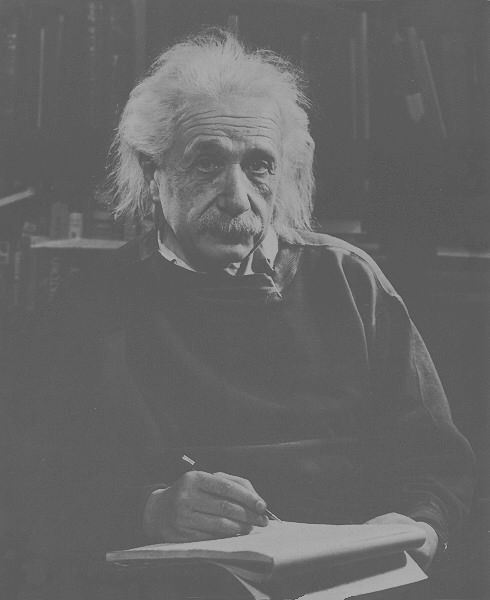

# FuzzyContrastEnhancer
Enhances contrast of images through fuzzy rules, based on the description in *Digital Image Processing, 4th Edition from Rafael Gonzales, chapter 3, page 233 - 235*.

###### Fuzzy Functions for Contrast Enhancements

###### Original Einstein image

###### Enhanded Einstein image

